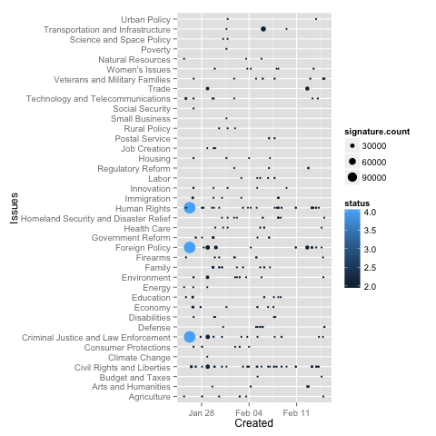
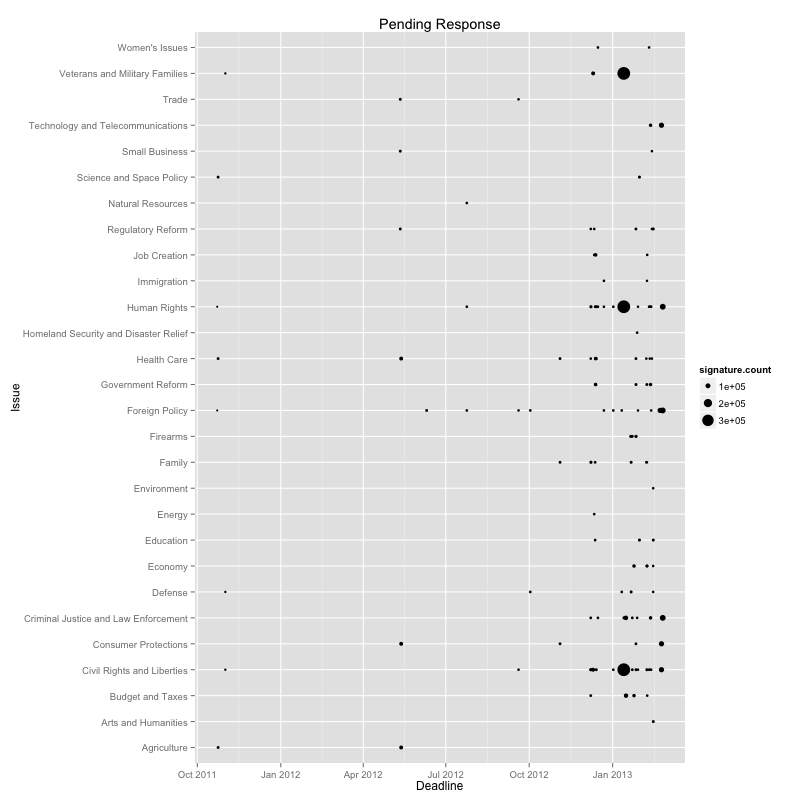
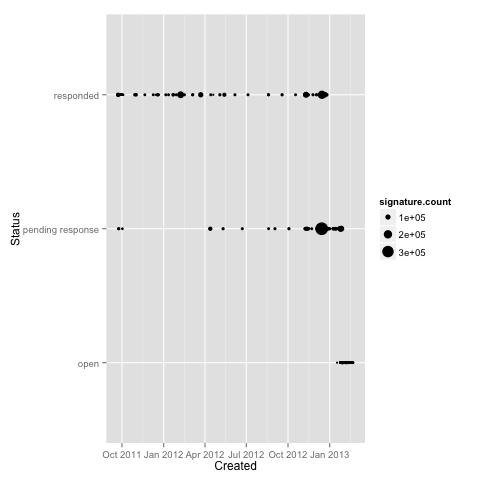

R We The People?
----------------

An R Package for working with the White House's We The People API.

The package is currently focused on loading petition data,
running ad-hoc analysis and exploratory visualizations.

Usage
-----

    install.packages('wethepeople')

    library(wethepeople)
    example(wethepeople)

    # Load petitions
    client <- WeThePeopleClient()
    petitions <- client$petitions()

    # Make some eye candy
    plot_issues_over_time(petitions)
    plot_issues_pending_response(petitions)

Examples
--------

There following images were generated using the package examples.

#### Petition Issues Over Time

#### Status by Creation Date

#### All Petitions' Title Word Cloud

#### All Petitions' Body Word Cloud

#### Single Petition Body and Title Word Cloud

